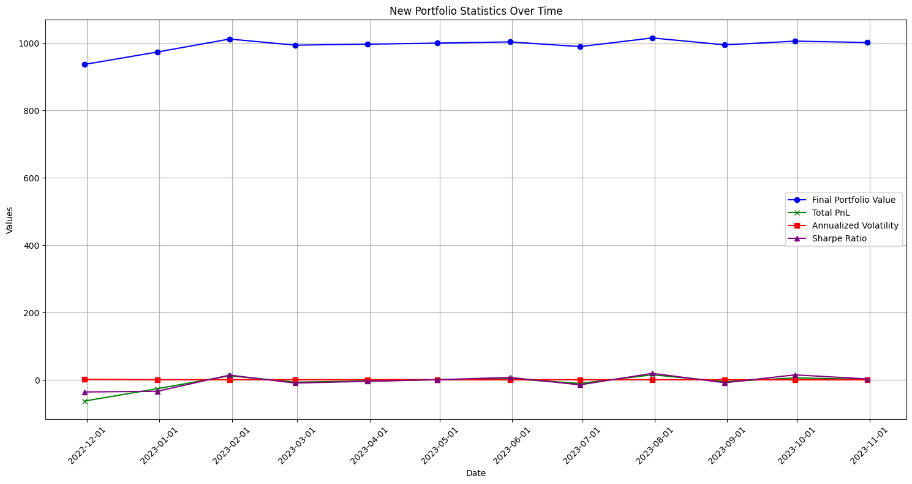

# Adapting Technical Indicators for High Volatility: A Trading Strategy for DOGE/USDT

## Introduction

### Crypto Market Background

The cryptocurrency market is renowned for its high volatility and dynamic nature, offering unique opportunities and challenges to traders. Unlike traditional markets, it operates round the clock, encapsulating a global audience and reacting swiftly to a wide array of economic, political, and social events.

### Product Selected: DOGEUSDT (Spot)

Dogecoin (DOGE) started as a novelty cryptocurrency known as a "memecoin" but has since grown into a prominent blockchain network and one of the popular altcoins. It was created by software engineers Jackson Palmer and Billy Markus to make cryptocurrency more accessible to people beyond Bitcoin. They saw Bitcoin mining as too complex and resource-intensive for the average person. Dogecoin aimed to provide a simpler entry point into the crypto industry.

Unlike many other cryptocurrencies with specific use cases, Dogecoin doesn't have a particular purpose. It was a collaborative effort by the crypto community and has gained listing on major exchange platforms. Dogecoin was originally based on Litecoin and was launched in 2013. (Data collected from Binance)

| Metric                  | Value                          | Date         |
|-------------------------|--------------------------------|--------------|
| Market Capitalization   | $11,173.85M                    |              |
| Market Dominance Index  | 0.8046%                        |              |
| Circulating Supply      | 141,893,536,383 DOGE           |              |
| Total                   | 141,893,536,383 DOGE           |              |
| Issue Date              | 2013-12-12                     |              |
| Historical High         | $0.7375666                     | 2021-05-08   |
| Historical Low          | $0.000085474399384111          | 2015-05-07   |


## Technical Analysis Indicators Selection

### Indicator Overview

In technical analysis, various indicators provide insights into market trends, momentum, volatility, and trading volumes. Among them, Trend Indicators (like moving average and MACD), Momentum Indicators (such as RSI), Volatility Indicators (like Bollinger Bands and ATR), and Volume Indicators (like OBV) are pivotal.

| Trend Indicators    | Momentum Indicators    | Volatility Indicators            | Volume Indicators                |
|---------------------|------------------------|----------------------------------|----------------------------------|
| Moving Average      | Stochastic Oscillator* | Bollinger Bands                  | Chaikin Oscillator*              |
| MACD                | CCI*                   | ATR                              | OBV*                             |
| Parabolic SAR*      | RSI*                   | Standard Deviation               | Volume Rate of Change            |

> Indicators with star* are **leading** indicators, rest are **lagging** indicators.

### Selection Rationale

A common pitfall in trading is the redundant use of similar-category indicators, leading to misleading confirmations and potentially erroneous trading decisions. A robust strategy involves the integration of diverse types of indicators. For our strategy, we've chosen RSI (a momentum indicator), Moving Average (a trend indicator), OBV (a volume indicator), and ATR (a volatility indicator), ensuring a comprehensive market analysis from different perspectives.

## Core Strategy

### Framework and Data Source

- **Framework**: The strategy is developed using Backtrader, a popular Python framework for backtesting and developing trading algorithms. Backtrader offers flexibility and ease of use, allowing for detailed strategy implementation and performance analysis.
- **Data Source**: The strategy utilizes minute-level (1m granularity) historical candlestick (K-line) data sourced from Binance. This high-resolution data provides detailed insights into market movements, essential for capturing short-term trading opportunities in the volatile cryptocurrency market.

### Strategy Mechanics

- **Data Preparation**: The historical data from Binance includes open, high, low, close prices, and trading volume. The time-series data is pre-processed to align with the Backtrader framework requirements.
- **Indicator Setup**: Key technical indicators used are:
    - **RSI**: For gauging market momentum. Lower and upper thresholds are set to identify overbought and oversold conditions.
    - **Moving Average (MA)**: To identify prevailing market trends. A shorter MA period is used for quicker response to price changes.
    - **On-Balance Volume (OBV)**: This volume indicator helps to understand the flow of funds and confirm the trend strength.
    - **Average True Range (ATR)**: Used for setting dynamic stop-loss levels based on market volatility.
- **Trading Logic**:
    - **Buy Signal**: Triggered when RSI is below a specified low (indicating potential undervaluation), the closing price is below the MA (suggesting a potential uptrend), and OBV is increasing (implying buying pressure).
    - **Sell Signal**: Activated when RSI is above a specified high (indicating potential overvaluation), the closing price is above the MA (suggesting a potential downtrend), and OBV is decreasing (implying selling pressure).


```python
def next(self):
        cash = self.broker.get_cash()
        value = self.broker.get_value()

        # Buy Logic
        if not self.position:
            if self.rsi < self.params.rsi_low and self.data.close[0] < self.ma[0] and self.obv[0] > self.obv[-1]:
                size = self.buy_size
                self.order = self.buy(size=size)
                self.buy_price = self.data.close[0]
                self.log('BUY EXECUTED')
                self.log_trade('buy', self.data.close[0], size, value, cash)

        # Sell Logic
        elif self.position and self.rsi > self.params.rsi_high and self.data.close[0] > self.ma[0] and self.obv[0] < self.obv[-1]:
            self.close() # sell all stocks
            self.log('SELL EXECUTED')
            self.log_trade('sell', self.data.close[0], self.position.size, value, cash)
            self.buy_price = None
            self.stop_loss_price = None
```


```json
{'Average Final Portfolio Value': 993.9725,
 'Total PnL': -74.98,
 'Average Annualized Volatility': 0.78625,
 'Average Sharpe Ratio': -3.8277,
 'Total Trades': 7171,
 'Total Turnover': 421283533583,
 'Highest Sharpe Ratio Date': Timestamp('2023-07-31 00:00:00'),
 'Lowest Sharpe Ratio Date': Timestamp('2022-11-30 00:00:00')}
```

## Adjustment #1: Risk Management with ATR

- **Stop Loss Implementation**: The strategy employs a stop loss mechanism where the exit price is set a certain distance below the entry price, calculated using the current ATR value. This dynamic stop loss adapts to the prevailing market volatility, providing a flexible approach to risk management.
- **ATR Utilization**: ATR's role in this strategy is crucial for adjusting the stop loss according to market conditions, helping to protect against sudden adverse price movements without exiting too early during normal market fluctuations.

```python
self.atr = btalib.ATR(self.high, self.low, self.close, period=self.params.atr_period)
self.stop_loss_price = self.buy_price - self.atr[0] * self.params.atr_multiplier
if self.position and self.stop_loss_price is not None and self.data.close[0] < self.stop_loss_price:
            self.close()
            self.log('STOP LOSS TRIGGERED')
            self.stop_loss_price = None
```


```json
{'Average Final Portfolio Value': 995.4416666666667,
 'Total PnL': -1.5000000000000226,
 'Average Annualized Volatility': 0.7862381604346824,
 'Average Sharpe Ratio': -0.3199642168541284,
 'Total Trades': 22266,
 'Total Turnover': 421283533583.0,
 'Highest Sharpe Ratio Date': Timestamp('2022-11-30 00:00:00'),
 'Lowest Sharpe Ratio Date': Timestamp('2023-08-31 00:00:00')}
```

Risk has been better managed, resulting in a reduction in PnL losses.


## Adjustment #2: Adjusting to High Volatility

- **Parameter Adjustments**: To adapt to the high volatility of the crypto market, specific adjustments include:
    - **RSI Range Modification**: Expanding the RSI range to capture more significant market movements without generating too many false signals.
    - **Shortening MA Period**: A shorter MA period makes the strategy more responsive to recent price changes.
    - **Incorporation of EMA**: The EMA is added for its sensitivity to recent price action, a vital feature in volatile markets

```python
class CombinedStrategy(bt.Strategy):
    params = (
        ('ema_period', 5),  # shorten EMA period
        ('rsi_period', 14),
        ('rsi_low', 20),  # set RSI low lower
        ('rsi_high', 80),  # set RSI high higher
        # ......
    )

    def __init__(self):
        self.ema = bt.indicators.ExponentialMovingAverage(self.data.close, period=self.params.ema_period)
        self.rsi = bt.indicators.RSI(self.data.close, period=self.params.rsi_period)
```


```json
{'Average Final Portfolio Value': 995.9581818181819,
 'Total PnL': -0.910000000000001,
 'Average Annualized Volatility': 0.8145454545454546,
 'Average Sharpe Ratio': 0.32636363636363636,
 'Total Trades': 240,
 'Total Turnover': 404542090960.0,
 'Highest Sharpe Ratio Date': Timestamp('2023-04-30 00:00:00'),
 'Lowest Sharpe Ratio Date': Timestamp('2023-03-31 00:00:00')}
```

The PnL in the current version of the portfolio shows a slight improvement compared to the previous version, although the improvement is not significant. 

However, a noteworthy change is the significant reduction in the number of trades, which is now only one-tenth of the previous level. This reduction has led to substantially lower trading costs."

## Conclusion

### Risk Management in the Strategy

- The strategy's risk is managed through a balanced use of diverse indicators, a dynamic ATR-based stop loss, and adjustments catering to the high volatility of the crypto market.

### Potential Improvements:

- **ML-Based Parameter Optimization**: Implementing machine learning algorithms can significantly enhance the strategy's effectiveness. For instance, using algorithms like genetic programming or reinforcement learning to optimize RSI and MA parameters could result in a more adaptive and profitable strategy.
- **Predictive Analytics**: Machine learning models could be trained on historical data to predict future price movements, providing a more nuanced approach than traditional technical analysis. Features like price patterns, trading volume, and market sentiment could be leveraged to improve prediction accuracy.
- **Inclusion of Transaction Costs (Trading Friction)**: Incorporating transaction costs, such as commission fees and market impact costs, into the backtesting model can provide a more accurate forecast of trading performance. This is particularly critical in high-frequency trading strategies, where such costs can significantly impact overall returns.

- **Adjustment in Portfolio Allocation**: Increasing the allocation towards dogeusdt in the portfolio would make the impact of the strategy more visible in the charts, aiding in better performance evaluation. However, this adjustment should also consider principles of overall risk management and asset diversification.

- **Utilizing Longer Timeframes for Backtesting**: Currently, the backtesting uses minute-level data within a year, which may not capture long-term market trends and cyclic movements. Expanding the time range of data can provide a more comprehensive perspective, especially for capturing major market trends and for long-term investment strategies.

- **Dynamic Control of Purchase Quantities Using Machine Learning**: Applying machine learning techniques to dynamically adjust the quantity of purchases based on market price fluctuations and overall portfolio cost. This approach can adapt more flexibly to market changes, enhancing the adaptability and profit potential of the strategy.

- **Incorporating Hedging Strategies for Risk Control**: Hedging is an essential risk management tool that can reduce potential losses by making trades opposite to the primary investment. Integrating hedging strategies can help maintain earning potential while effectively reducing the impact of market volatility on the investment portfolio.
